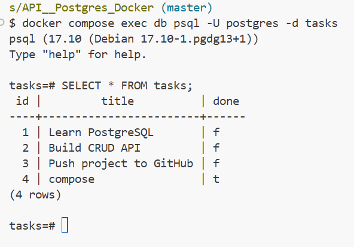

# Task API

A simple FastAPI application for creating and managing tasks using PostgreSQL as the database.

## What this is

This project provides a REST API for managing tasks. It uses:

* FastAPI for the API
* PostgreSQL for data storage
* Docker and Docker Compose to run the complete stack

## Run the application

Make sure Docker is installed, then run:

```bash
docker compose up
```

This starts both the FastAPI application and PostgreSQL database.

The API will be available at:

```text
http://localhost:3000
```

Swagger documentation:

```text
http://localhost:3000/docs
```

## Environment variables

Copy `.env.example` to `.env` and set the required environment variables:

```bash
cp .env.example .env
```

See `.env.example` for the variables and placeholder values.

**Do not commit `.env` to GitHub.** It contains local configuration/secrets.

## API Endpoints

| Method | Endpoint           | Description             |
| ------ | ------------------ | ----------------------- |
| GET    | `/tasks`           | Get all tasks           |
| GET    | `/tasks/{task_id}` | Get a single task by ID |
| POST   | `/tasks`           | Create a new task       |
| PUT    | `/tasks/{task_id}` | Update a task by ID     |
| DELETE | `/tasks/{task_id}` | Delete a task by ID     |

## Example request

Create a new task:

```bash
curl -i -X POST http://localhost:3000/tasks \
  -H "Content-Type: application/json" \
  -d '{"title":"Learn Docker","done":false}'
```

## Database

PostgreSQL stores the tasks in the `tasks` database.

Docker Compose uses the `taskdata` volume so that task data remains available after the containers are stopped and started again.

### Database verification

### Database Screenshot



```sql
SELECT * FROM tasks;
```

## One-command stack

From a clean project setup:

```bash
cp .env.example .env
docker compose up
```

The complete API and PostgreSQL stack starts without manual database setup.
