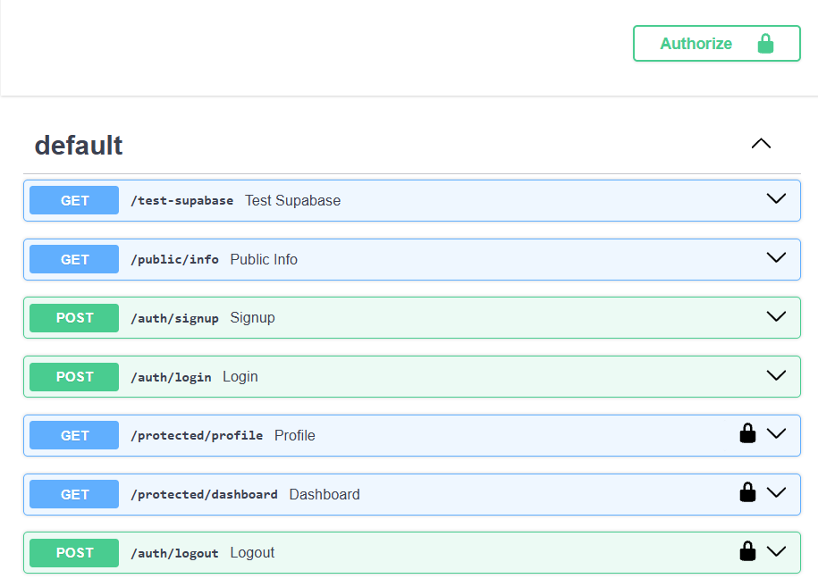

# Task API

A RESTful Task Management API built with **FastAPI** and **PostgreSQL**. The project provides endpoints for creating, reading, updating, and deleting tasks, along with authentication and protected API routes.

## What This Project Is

This project is a backend REST API developed using:

* **FastAPI** — API development and automatic Swagger documentation
* **PostgreSQL** — database for storing task data
* **Supabase Auth** — user authentication
* **Docker & Docker Compose** — running the application and database
* **Python** — backend programming language

The API supports user authentication, protected routes, and task management operations.

Authentication flow:

```text
Sign Up
   ↓
Log In
   ↓
Receive Access Token
   ↓
Authorize in Swagger
   ↓
Access Protected Routes
   ↓
Logout
```

## Environment Variables

Create a `.env` file from the provided example:

```bash
cp .env.example .env
```

Set the required environment variables in `.env`.

Example:

```env
SUPABASE_URL=your_supabase_url
SUPABASE_KEY=your_supabase_key

DATABASE_URL=your_database_url
```

Use the actual values for your local environment.

**Do not commit `.env` to GitHub.** It may contain credentials and other sensitive configuration.

The `.env.example` file should contain only placeholder values.

## Run the Application

The complete application can be started with:

```bash
docker compose up
```

This starts the FastAPI application and PostgreSQL database.

The API will be available at:

```text
http://localhost:3000
```

Swagger UI:

```text
http://localhost:3000/docs
```

## API Reference

| Method | Endpoint           | Authentication | Description             |
| ------ | ------------------ | -------------- | ----------------------- |
| GET    | `/tasks`           | No             | Get all tasks           |
| GET    | `/tasks/{task_id}` | No             | Get a single task by ID |
| POST   | `/tasks`           | No             | Create a new task       |
| PUT    | `/tasks/{task_id}` | No             | Update a task by ID     |
| DELETE | `/tasks/{task_id}` | No             | Delete a task by ID     |

### Authentication Endpoints

The application also provides authentication endpoints:

| Method | Endpoint       | Authentication | Description                                    |
| ------ | -------------- | -------------- | ---------------------------------------------- |
| POST   | `/auth/signup` | No             | Create a new user account                      |
| POST   | `/auth/login`  | No             | Authenticate a user and obtain an access token |
| POST   | `/auth/logout` | Yes            | Sign out the authenticated user                |

### Protected Endpoints

Protected endpoints require a valid Bearer access token.

| Method | Endpoint               | Authentication | Description                               |
| ------ | ---------------------- | -------------- | ----------------------------------------- |
| GET    | `/protected/profile`   | Yes            | Get the authenticated user's profile      |
| GET    | `/protected/dashboard` | Yes            | Access the authenticated user's dashboard |

Authentication is handled through a reusable FastAPI dependency:

```text
get_current_user()
```

The dependency validates the Bearer token and makes the authenticated user available to protected routes.

## Authentication

After logging in successfully, the API returns an access token.

Example:

```json
{
  "access_token": "your_access_token",
  "token_type": "bearer"
}
```

The token can be supplied to protected endpoints using the HTTP Authorization header:

```http
Authorization: Bearer <access_token>
```

Invalid or missing authentication results in a `401 Unauthorized` response.

## Swagger UI

FastAPI automatically provides interactive API documentation through Swagger UI.

Open:

```text
http://localhost:3000/docs
```

Protected endpoints display a lock icon. Click **Authorize**, enter the access token obtained from login, and then use **Try it out** to call protected endpoints directly from the browser.

### Swagger Screenshot



## Example Request

Create a new task:

```bash
curl -i -X POST http://localhost:3000/tasks \
  -H "Content-Type: application/json" \
  -d '{"title":"Learn Docker","done":false}'
```

## Database

PostgreSQL is used to store task data.

Docker Compose manages the PostgreSQL service and uses the `taskdata` volume so that database data persists when containers are stopped and started again.

### Database Verification

To verify the task data:

```sql
SELECT * FROM tasks;
```

### Database Screenshot


## Project Structure

```text
.
├── main.py
├── auth.py
├── database.py
├── models.py
├── schemas.py
├── Dockerfile
├── docker-compose.yml
├── .env.example
├── README.md
└── swagger.png
```

## One-Command Run

After configuring the environment variables, start the complete application with:

```bash
docker compose up
```

The FastAPI application and PostgreSQL database will start together without requiring manual database setup.

## Security Notes

* Do not commit `.env` to the repository.
* Do not expose Supabase keys or database credentials in source code.
* Protected endpoints require a valid Bearer access token.
* Authentication is handled through a reusable authentication guard rather than duplicating token-validation logic in every protected route.
